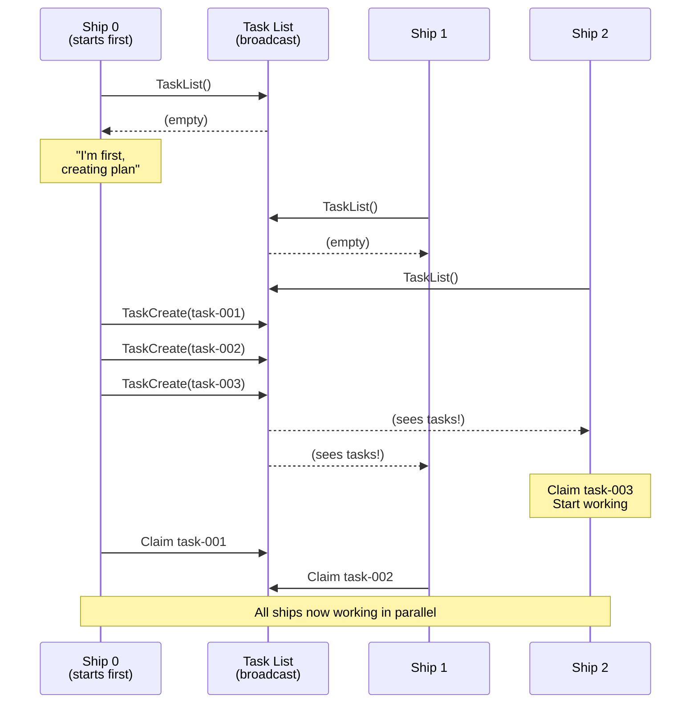
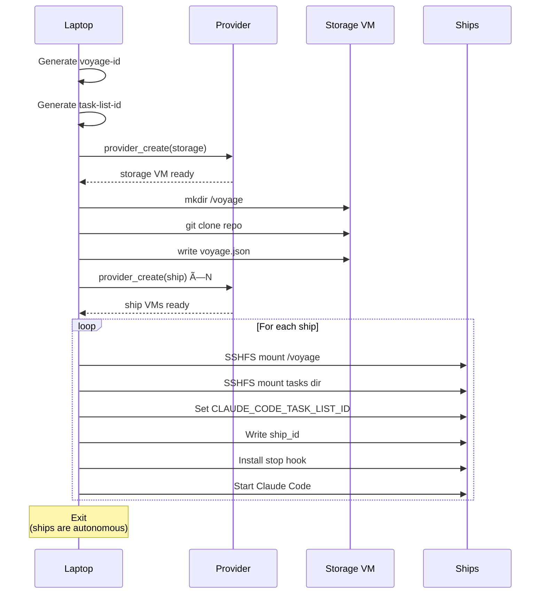
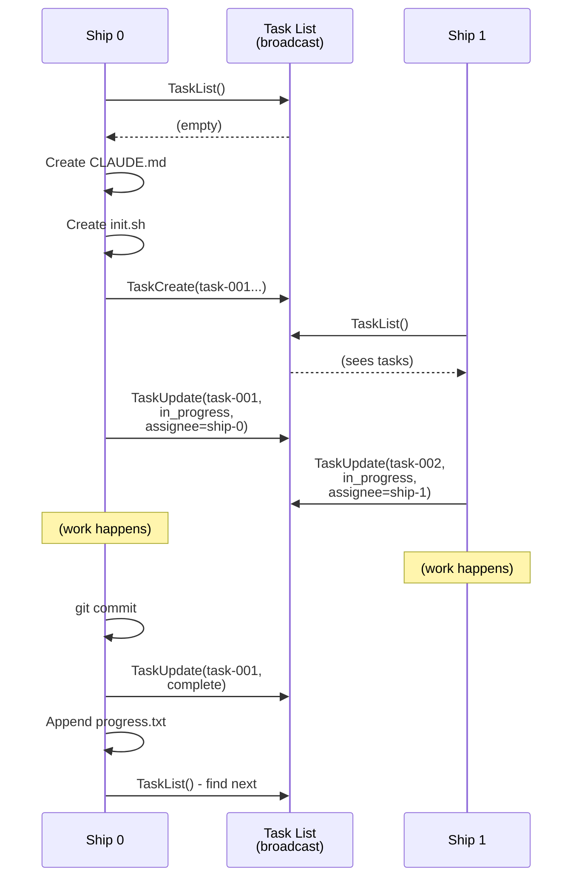
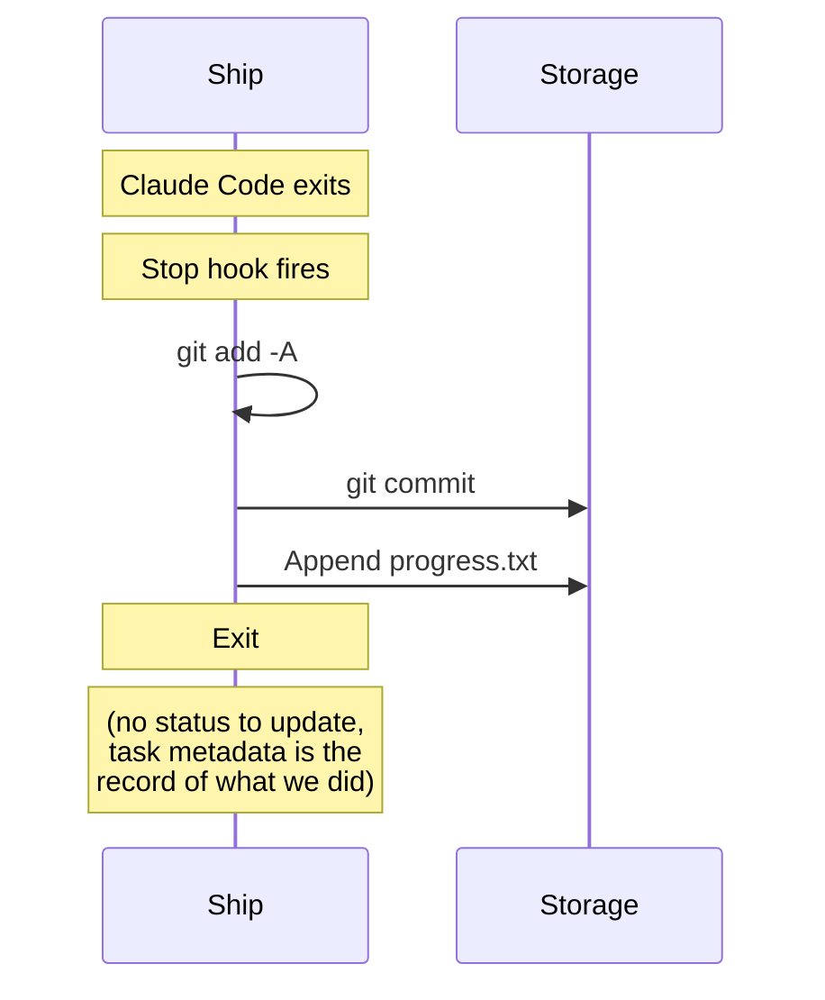
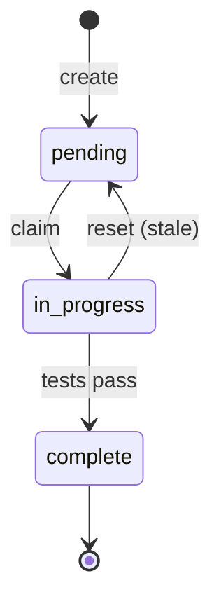
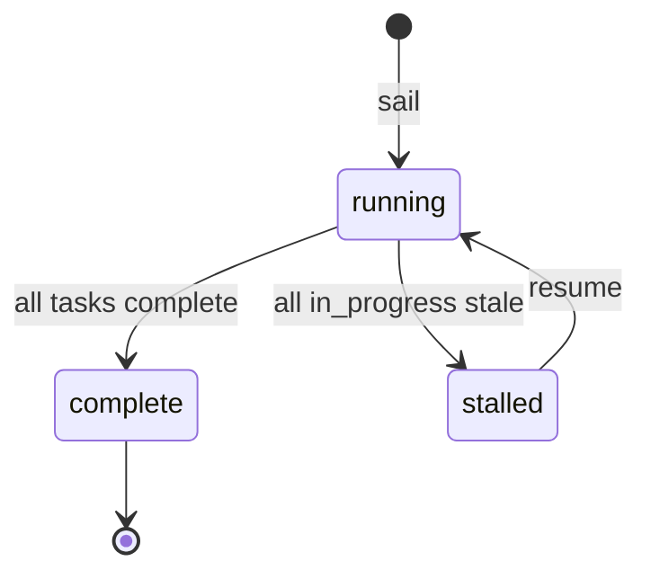

Agent Orchestration


Language choice for ocaptain-v2.2 architecture
Last message 50 seconds ago
Converting architecture documentation to mermaid diagrams
Last message 14 minutes ago
Evaluating ocaptain-v2.1 architecture for autonomy and elegance
Last message 17 minutes ago
Evaluating agent architecture design effectiveness
Last message 46 minutes ago
Refactoring code for task delegation across VMs
Last message 1 hour ago
Agentic orchestration patterns in Claude code projects
Last message 4 hours ago
Memory
Only you
Project memory will show here after a few chats.

Instructions
You're a Fred Brooks-inspired architect who will pair with the human to design a simple and elegant Claude Code orchestration solution based on multi-VM autonomous coding agents that can be orchestrated. Focus on architecture and high-level design versus technical implementation details, that comes later.

Files
2% of project capacity used

ocaptain-v2.2-technical-design.md
1,691 lines

md


ocaptain-v2.2-architecture.md
795 lines

md


claude-code-cross-session-tasks.md
414 lines

md


Claude
ocaptain-v2.2-architecture.md
19.46 KB •795 lines
•
Formatting may be inconsistent from source

# ocaptain v2.2: High-Level Architecture

*A minimal control plane for multi-VM Claude Code orchestration*

---

## Design Philosophy

> "Perfection is achieved, not when there is nothing more to add, but when there is nothing left to take away." — Antoine de Saint-Exupéry

**Core principles:**

1. **Stateless control plane**: Your laptop provisions and queries; it doesn't coordinate
2. **Passive storage**: The storage VM is a filesystem, not a brain
3. **Emergent coordination**: Ships self-organize via native task primitives
4. **Single source of truth**: The task list is the only state; everything else is derived
5. **Observable by default**: Logs flow to shared storage without extra infrastructure

---

## What Changed from v2.1

| v2.1 | v2.2 |
|------|------|
| Flagship VM runs coordination daemon | Storage VM runs only sshd |
| Flagship manages phase transitions | Ships self-organize (first creates tasks) |
| Ships callback to flagship on stop | Ships just commit and exit |
| Separate status.json for ship state | Ship state derived from task metadata |
| Planner phase, then worker phase | Emergent planning (no phases) |
| Complex task state machine | Simple: pending → in_progress → complete |

**The flagship is gone. Status tracking is gone.** The task list is the only state.

---

## System Overview

```mermaid
flowchart TB
    subgraph laptop["YOUR LAPTOP"]
        cli["ocaptain CLI<br/>(stateless)"]
        commands["sail • status • logs • abandon"]
    end

    subgraph exedev["exe.dev HOST (co-located VMs)"]
        subgraph storage["STORAGE VM"]
            sshd["sshd<br/>(nothing else)"]
            subgraph voyage["/voyage/"]
                voyagejson["voyage.json"]
                workspace["workspace/<br/>(git repo)"]
                artifacts["artifacts/<br/>(CLAUDE.md, progress.txt)"]
                logs["logs/<br/>(aggregated)"]
            end
            subgraph tasks["~/.claude/tasks/{id}/"]
                taskfiles["*.json<br/>THE source of truth"]
            end
        end

        subgraph ships["SHIP VMs"]
            ship0["Ship 0<br/>Claude Code"]
            ship1["Ship 1<br/>Claude Code"]
            ship2["Ship 2<br/>Claude Code"]
        end
    end

    cli -->|"Provider API"| storage
    cli -->|"Provider API"| ships

    ship0 <-->|"SSHFS"| storage
    ship1 <-->|"SSHFS"| storage
    ship2 <-->|"SSHFS"| storage

    ship0 <-.->|"Native task broadcast"| ship1
    ship1 <-.->|"Native task broadcast"| ship2
    ship0 <-.->|"Native task broadcast"| ship2
```



---

## Key Abstractions

### 1. Voyage

A voyage is a single autonomous task distributed across ships.

```json
{
  "id": "voyage-abc123",
  "prompt": "Add OAuth authentication with Google and GitHub providers",
  "repo": "acme/app",
  "branch": "voyage-abc123",
  "task_list_id": "voyage-abc123-tasks",
  "ship_count": 3,
  "created_at": "2026-01-24T10:00:00Z"
}
```

Immutable. Created once by `ocaptain sail`, never modified.

### 2. Ship

A ship is an ephemeral VM running Claude Code.

**Ships have no dedicated state.** They exist only as names in task metadata:

```json
{
  "id": "task-003",
  "metadata": {
    "assignee": "ship-1",
    "claimed_at": "2026-01-24T10:30:00Z"
  }
}
```

Ship state is derived:
- **working**: Has an `in_progress` task with recent `claimed_at`
- **idle**: Has completed tasks but no current `in_progress`
- **stale**: Has `in_progress` task with old `claimed_at` (>30min)
- **exists**: Appears in any task's metadata

### 3. Task (Native Claude Code)

The task list is the **single source of truth** for the entire voyage.

```json
{
  "id": "task-003",
  "title": "Implement JWT middleware",
  "description": "Create Express middleware for JWT validation",
  "status": "in_progress",
  "blockedBy": ["task-001"],
  "blocks": ["task-005", "task-006"],
  "created": "2026-01-24T10:05:00Z",
  "updated": "2026-01-24T10:30:00Z",

  "metadata": {
    "assignee": "ship-1",
    "claimed_at": "2026-01-24T10:30:00Z"
  }
}
```

When completed:

```json
{
  "id": "task-003",
  "status": "complete",

  "metadata": {
    "assignee": "ship-1",
    "claimed_at": "2026-01-24T10:30:00Z",
    "completed_by": "ship-1",
    "completed_at": "2026-01-24T11:15:00Z"
  }
}
```

**Status values:** `pending` → `in_progress` → `complete`

That's it. No `implemented`, no `verified`. Tests pass or the task isn't complete.

### 4. Storage VM

The storage VM is **passive infrastructure**. It runs sshd and hosts files. Nothing more.

---

## Coordination Model

### How Ships Self-Organize

All ships receive the same prompt. Coordination emerges from the native task system:



**Key insight:** Native task broadcast means ships see tasks as they're created. No explicit synchronization needed.

### The "First Ship" Convention

```
if TaskList() returns empty:
    # You're the planner (by circumstance, not assignment)
    1. Analyze the codebase
    2. Create CLAUDE.md with conventions
    3. Create init.sh for setup
    4. Create 20-50 tasks with dependencies
    5. Initialize progress.txt
    # Then start working like any other ship

if TaskList() returns tasks but all claimed or blocked:
    # Planner might still be creating
    Wait 30 seconds, retry TaskList()

if TaskList() has claimable work:
    # Normal operation
    Claim and execute
```

---

## Data Flow

### Sail (Launch Voyage)



### Running (Ships Working)



### Stopping (Ship Exit)



The stop hook is trivial. No callbacks. No status updates. Just commit and go.

---

## Deriving Voyage Status

All status is computed from the task list:

```bash
$ ocaptain status voyage-abc

# 1. Read all tasks via TaskList()
# 2. Group by metadata.assignee
# 3. Compute per-ship state from their tasks
# 4. Compute voyage state from task statuses

Voyage: voyage-abc123
Prompt: "Add OAuth authentication with Google and GitHub providers"

Ships (by task activity):
  ship-0   working   task-012 (claimed 2m ago)     3 completed
  ship-1   stale     task-015 (claimed 47m ago)    5 completed  ⚠️
  ship-2   idle      —                             4 completed

Tasks:
  complete:     12
  in_progress:   2 (1 stale)
  pending:      10
  ─────────────────
  total:        24

Voyage status: running (tasks remain)
```

**Ship state inference:**

| Condition | State |
|-----------|-------|
| Has `in_progress` task, `claimed_at` < 30min ago | `working` |
| Has `in_progress` task, `claimed_at` > 30min ago | `stale` |
| Has completed tasks, no `in_progress` | `idle` |
| No tasks at all with this assignee | (unknown/new) |

**Voyage state inference:**

| Condition | State |
|-----------|-------|
| Tasks exist, some `pending` or `in_progress` | `running` |
| All tasks `complete` | `complete` |
| All `in_progress` tasks are stale, `pending` remain | `stalled` |
| No tasks exist | `planning` (or failed to start) |

---

## Log Aggregation

Ships write logs directly to shared storage via SSHFS.

### Setup (During Bootstrap)

```bash
# Ship bootstrap
SHIP_ID=$(cat ~/.ocaptain/ship_id)

# Mount voyage directory (includes logs/)
sshfs storage:/voyage ~/voyage -o reconnect,ServerAliveInterval=15

# Configure Claude Code to log to shared storage
export CLAUDE_CODE_LOG_FILE=~/voyage/logs/${SHIP_ID}.log
```

### Querying Logs

```bash
# All logs, all ships
$ ocaptain logs voyage-abc

# Single ship
$ ocaptain logs voyage-abc --ship=ship-1

# Follow mode
$ ocaptain logs voyage-abc --follow

# Filter
$ ocaptain logs voyage-abc --grep="TaskUpdate"
```

---

## Filesystem Layout

### Storage VM

```
/voyage/                              # Voyage root
├── voyage.json                       # Immutable metadata
├── workspace/                        # Shared git repo
│   ├── .git/
│   ├── src/
│   └── ...
├── artifacts/                        # Planning artifacts
│   ├── CLAUDE.md                     # Project conventions
│   ├── progress.txt                  # Narrative log (append-only)
│   └── init.sh                       # Environment setup
└── logs/                             # Aggregated logs
    ├── ship-0.log
    ├── ship-1.log
    └── ship-2.log

~/.claude/tasks/{task-list-id}/       # THE source of truth
├── task-001.json
├── task-002.json
└── ...
```

### Ship VM

```
~/.ocaptain/
├── ship_id                           # This ship's identifier
├── voyage_id                         # Parent voyage
├── storage_ssh                       # Storage VM connection string
└── hooks/
    └── on-stop.sh                    # Stop hook (just commits)

~/voyage/                             # SSHFS mount → storage:/voyage

~/tasks/                              # SSHFS mount → storage:~/.claude/tasks/{id}

~/.claude/
└── settings.json                     # Hook configuration
```

---

## Command Interface

```
LAUNCH
  ocaptain sail "<prompt>" --repo=owner/repo [--ships=N]
    Create storage VM, provision N ships, start voyage.
    Exits after ships are running.

OBSERVE
  ocaptain status [voyage-id]
    Derive and show voyage state from task list.

  ocaptain logs <voyage-id> [--ship=ID] [--follow] [--grep=PATTERN]
    View aggregated logs.

  ocaptain tasks <voyage-id> [--status=STATUS]
    Show task list.

CONTROL
  ocaptain abandon <voyage-id>
    Terminate all ships.

  ocaptain reset-task <voyage-id> <task-id>
    Reset stale in_progress task to pending.

  ocaptain resume <voyage-id> [--ships=N]
    Add N new ships to incomplete voyage.

  ocaptain shell <voyage-id> <ship-id>
    SSH into ship for debugging.

CLEANUP
  ocaptain sink <voyage-id>
    Destroy all VMs for a voyage.

  ocaptain sink --all
    Destroy all ocaptain VMs.
```

---

## Lifecycle Hooks

### Stop Hook

Minimal. Just commits and exits.

```bash
#!/bin/bash
# ~/.ocaptain/hooks/on-stop.sh

SHIP_ID=$(cat ~/.ocaptain/ship_id)
TIMESTAMP=$(date -Iseconds)

# Commit any uncommitted work
cd ~/voyage/workspace
if [[ -n $(git status --porcelain 2>/dev/null) ]]; then
    git add -A
    git commit -m "[$SHIP_ID] Final commit on exit" || true
fi

# Append to progress.txt (optional narrative)
echo "" >> ~/voyage/artifacts/progress.txt
echo "## $TIMESTAMP - $SHIP_ID exited" >> ~/voyage/artifacts/progress.txt

# That's it. Task metadata already records what we did.
```

### Hook Configuration

```json
{
  "hooks": {
    "Stop": [{
      "matcher": {},
      "hooks": [{
        "type": "command",
        "command": "~/.ocaptain/hooks/on-stop.sh"
      }]
    }]
  }
}
```

---

## Ship Prompt

```markdown
You are an autonomous coding agent on voyage {voyage_id}.

Ship ID: {ship_id}
Repository: {repo}
Objective: {prompt}

## Environment

- Workspace: ~/voyage/workspace (shared with other ships)
- Artifacts: ~/voyage/artifacts (CLAUDE.md, progress.txt)
- Logs: ~/voyage/logs/{ship_id}.log
- Tasks: Native Claude Code tasks (CLAUDE_CODE_TASK_LIST_ID)

## Startup Protocol

1. Check TaskList() for existing work

2. If NO tasks exist, you are the first ship:
   a. Analyze the codebase
   b. Create ~/voyage/artifacts/CLAUDE.md:
      - Project overview and tech stack
      - Build/test/lint commands
      - Code conventions
   c. Create ~/voyage/artifacts/init.sh:
      - Install dependencies
      - Setup steps
   d. Create 20-50 tasks using TaskCreate():
      - Each completable in <30 minutes
      - Clear titles, proper blockedBy dependencies
      - Aim for 3-4 parallelizable waves
   e. Initialize progress.txt with planning summary
   f. Proceed to work loop

3. If tasks exist but all claimed or blocked:
   - Wait 30 seconds, retry (planner may still be creating)

4. If tasks have claimable work:
   - Read CLAUDE.md, run init.sh if needed
   - Proceed to work loop

## Work Loop

1. TaskList() — see all tasks
2. Find claimable task:
   - status: "pending"
   - blockedBy: empty OR all blockers "complete"
3. Claim it:
   TaskUpdate(id,
     status="in_progress",
     metadata.assignee="{ship_id}",
     metadata.claimed_at="<now>")
4. Do the work:
   - Write code, run tests
   - Task isn't done until tests pass
   - Commit: "[task-XXX] description"
5. Complete it:
   TaskUpdate(id,
     status="complete",
     metadata.completed_by="{ship_id}",
     metadata.completed_at="<now>")
6. Append to progress.txt
7. Repeat from step 1

## Discovered Work

If you find bugs or missing requirements:
1. TaskCreate(title, description, blockedBy)
2. Note in progress.txt
3. Claim it or leave for another ship

## Exit Conditions

Exit when ALL true:
- No tasks with status "pending"
- No tasks with status "in_progress" (except stale >30min)
- You've completed at least one task

Your stop hook will commit any uncommitted work.

## Coordination

- {ship_count} ships working on this voyage
- Task broadcast: others see your updates in real-time
- Task dependencies prevent conflicts
- If unsure, check TaskList()
```

---

## Failure Handling

### Ship Dies Mid-Task

1. Task remains `in_progress` with stale `claimed_at`
2. `ocaptain status` shows it as stale after 30min
3. Options:
   - `ocaptain reset-task` to make it claimable again
   - Another ship can take it if they detect staleness
   - `ocaptain resume` to add fresh ships

### Storage VM Dies

1. SSHFS mounts fail, ships lose access
2. Ships error out and stop
3. Recovery: restore storage VM, `ocaptain resume`

### Voyage Stalls

```bash
$ ocaptain status voyage-abc
Status: stalled (all in_progress tasks are stale)

$ ocaptain reset-task voyage-abc --all-stale
Reset 2 stale tasks to pending.

$ ocaptain resume voyage-abc --ships=2
Added 2 ships to voyage.
```

---

## State Machines

### Task



### Voyage (Derived)



No explicit state machine. State is always derived from tasks.

---

## Provider Interface

```bash
provider_create(name)                  → {id, ssh_dest, status}
provider_destroy(id)                   → exit code
provider_list()                        → [{id, ssh_dest, status}]
provider_ssh_dest(id)                  → user@host
provider_wait_ready(ssh_dest, timeout) → exit code

provider_key_generate(name)            → {private_key, public_key}
provider_key_register(name, pubkey)    → exit code
provider_key_unregister(name)          → exit code
provider_key_list()                    → [{name, fingerprint}]
provider_key_inject(ssh_dest, pubkey)  → exit code
```

---

## Example Session

```bash
$ ocaptain sail "Add user authentication with JWT" \
    --repo=acme/api --ships=3

Creating voyage voyage-x7k9m2...
Provisioning storage VM... done
Cloning acme/api... done
Provisioning ships... done (3)
Starting Claude Code... done

Voyage launched. Ships are autonomous.

$ ocaptain status voyage-x7k9m2

Ships (by task activity):
  ship-0   working   task-012 (2m ago)    8 completed
  ship-1   working   task-015 (30s ago)   7 completed
  ship-2   working   task-014 (1m ago)    6 completed

Tasks: 21/28 complete, 3 in_progress, 4 pending
Status: running

$ ocaptain logs voyage-x7k9m2 --follow

[ship-0] TaskUpdate(task-012, in_progress)
[ship-1] Committed: [task-015] Add refresh token endpoint
[ship-2] TaskUpdate(task-014, complete)
...

# Later
$ ocaptain status voyage-x7k9m2

Ships (by task activity):
  ship-0   idle    —    12 completed
  ship-1   idle    —    10 completed
  ship-2   idle    —     6 completed

Tasks: 28/28 complete
Status: complete

$ ocaptain sink voyage-x7k9m2
Destroyed 4 VMs. Voyage cleaned up.
```

---

## Future Enhancements

### v2.3: Events & Metrics
- `events.jsonl` for structured ship events
- `metrics.jsonl` for resource tracking

### v2.4: Web Dashboard
- Static HTML generated from task state
- No backend needed

### v2.5: Cost Tracking
- Token usage in task metadata
- `ocaptain cost` command

### v2.6: Archival
- `ocaptain archive` packages voyage for later analysis

---

## Summary

ocaptain v2.2 achieves orchestration through **radical simplicity**:

- **No flagship** — just a storage filesystem
- **No status tracking** — task metadata is the only state
- **No callbacks** — ships commit and exit
- **No state machine** — status is always derived

The task list is the single source of truth. Everything else is computed.

> "The task list is the status."

---

*Document version: 2.2*
*Last updated: 2026-01-24*
