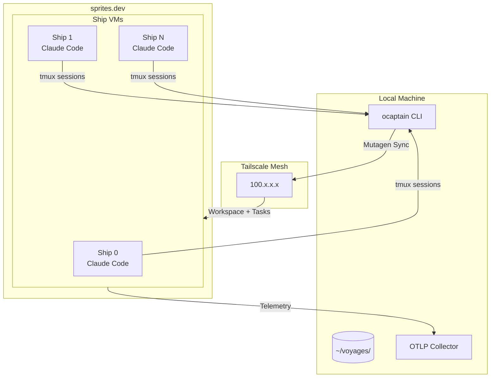

# ocaptain

[](https://www.python.org/)
[](https://sprites.dev)

> O Captain! my Captain! our fearful Claude Code session is done, The repo has weather'd every rack, the prize we sought is won.

Minimalist multi-coding agent control plane built on [sprites.dev](https://sprites.dev) VMs with [Tailscale](https://tailscale.com) mesh networking. Orchestration is managed by Claude Code's built-in [task list](https://x.com/trq212/status/2014480496013803643?s=20) feature: work is distributed by the `ocaptain` CLI to cloud VMs ("ships") that work in parallel on a plan you generate with Claude.

No Kubernetes, no local sandboxes, no containers, no asking for permissions.

## Table of Contents

- [What it does](#what-it-does)
- [Why?](#why)
- [Quickstart](#quickstart)
- [Architecture](#architecture)
- [CLI Reference](#cli-reference)
- [Voyage Plans](#voyage-plans)
- [Configuration](#configuration)
- [Security](#security)

## What it does

Provisions a fleet of VMs on sprites.dev, each running an autonomous Claude Code agent. Ships sync files via Mutagen and coordinate through a shared task list—no central scheduler, just agents racing to complete work.

```
You (local) → ocaptain sail → sprites.dev VMs → Ships claim tasks → Code syncs back
```

## Why?

- Deploy parallel, autonomous Claude Code instances with one command
- No container complexity: full Linux VMs with direct access
- Watch Claude Code sessions in real-time via tmux
- Task-based coordination means no conflicts, no merge hell
- Local storage with Mutagen sync—no storage VM required
- Built-in OpenTelemetry observability

## Quickstart

### Prerequisites

1. [sprites.dev](https://sprites.dev) account with `sprite` CLI installed
2. [Tailscale](https://tailscale.com) installed and running
3. [Mutagen](https://mutagen.io) installed (`brew install mutagen-io/mutagen/mutagen`)
4. Claude Code long-lived OAuth token (subscription required, from `claude setup-token`)
5. Tailscale OAuth secret for ephemeral auth keys

### Install

```bash
# Clone and install
git clone https://github.com/smithclay/ocaptain.git
cd ocaptain
uv sync
```

### Set credentials

```bash
# Claude Code OAuth token (from `claude setup-token`)
export CLAUDE_CODE_OAUTH_TOKEN="your-token-here"

# Tailscale OAuth secret (for ephemeral ship auth keys)
export OCAPTAIN_TAILSCALE_OAUTH_SECRET="tskey-client-xxxx"

# sprites.dev org
export OCAPTAIN_SPRITES_ORG="your-org"

# Optional: GitHub token for private repos
export GH_TOKEN="ghp_xxxx"
```

### Check prerequisites

```bash
uv run ocaptain doctor
```

### Make a plan

At the moment, you need to use Claude Code to create a detailed dependency plan to pass to ocaptain.

### Use an existing plan

For convenience, example plans are available in the `examples/generated-plans` directory.

### Create a custom plan

In Claude Code, run the following then restart:

```bash
/plugin marketplace add smithclay/skills
/plugin install ocaptain-skills@smithclay-skills
```

You're now ready to generate a detailed plan in Claude Code using `/voyage-plan`:

```
Plan a voyage with ocaptain: take an empty repository and make a to-do list app.
```

### Launch a voyage

```bash
# A plan is required, see "Make a plan" above
uv run ocaptain sail ./examples/generated-plans/multilingual-readme

# Monitor status
uv run ocaptain status

# Attach to a ship's tmux session to watch Claude work
uv run ocaptain shell voyage-abc123 ship-0

# View aggregated logs
uv run ocaptain logs voyage-abc123 --follow

# Clone the workspace when done
uv run ocaptain clone voyage-abc123

# Scuttle the fleet
uv run ocaptain sink voyage-abc123
```

## Architecture



### Components

| Component | Description |
|-----------|-------------|
| **Local Voyages** | `~/voyages/<voyage-id>/` contains workspace, tasks, logs, and artifacts |
| **Ship VMs** | sprites.dev VMs running Claude Code autonomously in tmux sessions |
| **Tailscale Mesh** | Ships join tailnet with ephemeral keys for direct connectivity |
| **Mutagen Sync** | Two-way file sync between laptop and ships (workspace + tasks) |
| **Task List** | Shared JSON files in `~/.claude/tasks/`. Ships race to claim pending tasks |

### Voyage Lifecycle

1. **Setup** — Local voyage directory created, repo cloned, tasks seeded
2. **Bootstrap** — Ship VMs provisioned in parallel, join Tailscale, install Claude
3. **Sync** — Mutagen sessions established for workspace and tasks
4. **Launch** — Claude starts in tmux on each ship (autonomous operation)
5. **Work** — Ships claim tasks, do work, changes sync back via Mutagen
6. **Complete** — All tasks done, workspace ready to clone
7. **Sink** — VMs destroyed, Tailscale nodes removed

## CLI Reference

### `ocaptain sail <plan>`

Launch a new voyage from a plan directory.

```bash
uv run ocaptain sail ./plans/add-auth --ships 5
```

| Option | Description |
|--------|-------------|
| `--ships, -n` | Override recommended ship count |
| `--no-telemetry` | Disable OTLP telemetry collection |

### `ocaptain status [voyage_id]`

Show voyage status derived from task list. Auto-selects if only one active voyage.

```bash
uv run ocaptain status
uv run ocaptain status voyage-abc123
```

### `ocaptain logs <voyage_id>`

View aggregated logs from all ships.

```bash
uv run ocaptain logs voyage-abc123
uv run ocaptain logs voyage-abc123 --follow --grep "error"
```

| Option | Description |
|--------|-------------|
| `--ship, -s` | Filter to specific ship |
| `--follow, -f` | Stream logs in real-time |
| `--grep, -g` | Filter log lines by pattern |
| `--tail, -n` | Show last N lines |

### `ocaptain tasks <voyage_id>`

Display task list with status, assignees, and blockers.

```bash
uv run ocaptain tasks voyage-abc123
uv run ocaptain tasks voyage-abc123 --status pending
```

### `ocaptain shell <voyage_id> [ship_id]`

Attach to a ship's tmux session to observe Claude working.

```bash
uv run ocaptain shell voyage-abc123 ship-0      # Attach to ship's tmux
uv run ocaptain shell voyage-abc123 ship-0 --raw  # Direct SSH
```

### `ocaptain clone [voyage_id]`

Clone the workspace from local voyage storage.

```bash
uv run ocaptain clone                    # Auto-select if one voyage
uv run ocaptain clone voyage-abc123 -d ./my-copy
```

### `ocaptain sink <voyage_id>`

Destroy voyage VMs and clean up.

```bash
uv run ocaptain sink voyage-abc123       # Destroy ships
uv run ocaptain sink --all -f            # Destroy ALL ocaptain VMs
```

| Option | Description |
|--------|-------------|
| `--all` | Destroy ALL ocaptain VMs |
| `--force, -f` | Skip confirmation |

### `ocaptain doctor`

Check system prerequisites and configuration.

```bash
uv run ocaptain doctor
```

### `ocaptain telemetry-start` / `telemetry-stop`

Start or stop the local OTLP telemetry collector.

```bash
uv run ocaptain telemetry-start
uv run ocaptain telemetry-stop
```

## Configuration

### Environment Variables

| Variable | Required | Description |
|----------|----------|-------------|
| `CLAUDE_CODE_OAUTH_TOKEN` | Yes | Claude Code authentication token |
| `OCAPTAIN_TAILSCALE_OAUTH_SECRET` | Yes | Tailscale OAuth secret for ephemeral keys |
| `OCAPTAIN_SPRITES_ORG` | Yes | sprites.dev organization name |
| `GH_TOKEN` | No | GitHub token for private repos |
| `OCAPTAIN_DEFAULT_SHIPS` | No | Default ship count (default: `3`) |

### sprites.dev Setup

Install the `sprite` CLI and authenticate:

```bash
# Test connectivity
sprite list -o your-org

# Create a test sprite
sprite create -o your-org test-sprite
```

### Tailscale Setup

1. Create an OAuth client in the Tailscale admin console with `devices:write` scope
2. Set `OCAPTAIN_TAILSCALE_OAUTH_SECRET` to the client secret
3. Ensure your laptop is connected to the tailnet

## Security

### Token Handling

- OAuth tokens passed via environment variables, not command args
- Tailscale ephemeral keys expire automatically when ships are destroyed

### Network Isolation

- Ships communicate only via Tailscale mesh (no public IPs)
- Each ship is a full Linux VM with its own filesystem
- Mutagen sync scoped to specific directories

### Repository Access

- Private repos require `GH_TOKEN`
- Token validity checked before VM provisioning
- Clone failures surface immediately, not after fleet deploys
