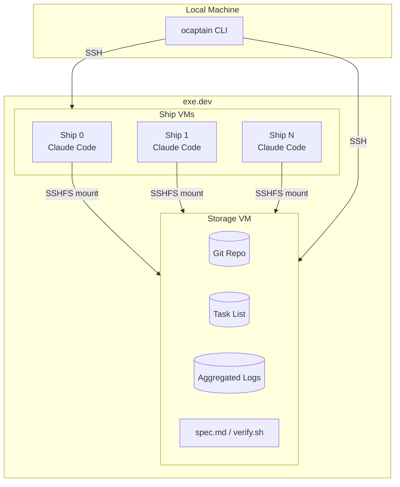

# ocaptain

[](https://www.python.org/)
[](https://exe.dev)

> O Captain! my Captain! our fearful Claude Code session is done, The repo has weather'd every rack, the prize we sought is won.

Minimalist multi-coding agent control plane built on top of [exe.dev](https://exe.dev) VMs. Orchestration is managed by Claude Code's built-in [task list](https://x.com/trq212/status/2014480496013803643?s=20) feature: work is distributed by the `ocaptain` CLI to cloud VMs ("ships") that work in parallel on a plan you generate with Claude.

No Kubernetes, no local sandboxes, no containers, no asking for permissions and less than 1400 lines of Python code.

## Table of Contents

- [What it does](#what-it-does)
- [Why?](#why)
- [Quickstart](#quickstart)
- [Architecture](#architecture)
- [CLI Reference](#cli-reference)
- [Voyage Plans](#voyage-plans)
- [Configuration](#configuration)
- [Security](#security)
- [Background](#background)

## What it does

Provisions a fleet of VMs on exe.dev, each running an autonomous Claude Code agent. Ships mount shared storage via SSHFS and coordinate through a shared task list—no central scheduler, just agents racing to complete work.

```
You (local) → ocaptain sail → exe.dev VMs → Ships claim tasks → Code lands in git
```

## Why?

- Deploy parallel, autonomous Claude Code instances with one command in the cloud
- No container complexity: full Linux VMs with SSH access
- Observe remote parallel in real-time via tmux
- Task-based coordination means no conflicts, no merge hell
- Built-in OpenTelemetry observability (WIP)

## Quickstart

### Prerequisites

1. [exe.dev](https://exe.dev) account with SSH configured
2. Claude Code long-lived OAuth token (subscription required, from `claude setup-token`)
3. GitHub PAT token (for private repos or pushing code)

### Install

```bash
# Clone and install
git clone https://github.com/smithclay/ohcommodore.git
cd ohcommodore
uv sync
```

### Set credentials

```bash
# Get a long-lived OAuth token associated with your subscription:
# run `claude setup-token` and use the value below
export CLAUDE_CODE_OAUTH_TOKEN="your-token-here"
export GH_TOKEN="ghp_xxxx"  # optional, for private repos
```

### Launch a voyage

```bash
# From a plan directory (see Voyage Plans section)
uv run ocaptain sail ./plans/my-feature

# Monitor status
uv run ocaptain status

# Watch ships work in real-time
uv run ocaptain shell voyage-abc123

# View aggregated logs
uv run ocaptain logs voyage-abc123 --follow

# Scuttle the fleet when done
uv run ocaptain sink voyage-abc123 --include-storage
```

## Architecture



### Components

| Component | Description |
|-----------|-------------|
| **Storage VM** | Central state: git repo, task list, logs, artifacts. Ships mount this via SSHFS. |
| **Ship VMs** | Worker agents running Claude Code. Claim tasks, do work, commit changes. |
| **Task List** | Shared JSON files in `~/.claude/tasks/`. Ships race to claim pending tasks. |
| **tmux Session** | Runs on storage VM. One pane per ship for real-time observation. |

### Voyage Lifecycle

1. **Provision** — Storage VM created, repo cloned, tasks seeded
2. **Bootstrap** — Ship VMs provisioned in parallel, mount shared storage
3. **Launch** — tmux session starts Claude Code on each ship
4. **Work** — Ships autonomously claim tasks, commit to shared branch
5. **Complete** — All tasks done, `verify.sh` runs, ships idle
6. **Sink** — VMs destroyed, artifacts preserved (optional)

## CLI Reference

### `ocaptain sail <plan>`

Launch a new voyage from a plan directory.

```bash
uv run ocaptain sail ./plans/add-auth --ships 5
```

| Option | Description |
|--------|-------------|
| `--ships, -n` | Override recommended ship count |

### `ocaptain status [voyage_id]`

Show voyage status derived from task list. Auto-selects if only one active voyage.

```bash
uv run ocaptain status
uv run ocaptain status voyage-abc123
```

### `ocaptain logs <voyage_id>`

View aggregated logs from all ships.

```bash
uv run ocaptain logs voyage-abc123
uv run ocaptain logs voyage-abc123 --follow --grep "error"
```

| Option | Description |
|--------|-------------|
| `--ship, -s` | Filter to specific ship |
| `--follow, -f` | Stream logs in real-time |
| `--grep, -g` | Filter log lines by pattern |
| `--tail, -n` | Show last N lines |

### `ocaptain tasks <voyage_id>`

Display task list with status, assignees, and blockers.

```bash
uv run ocaptain tasks voyage-abc123
uv run ocaptain tasks voyage-abc123 --status pending
```

### `ocaptain shell <voyage_id> [ship_id]`

Attach to tmux session to observe ships working.

```bash
uv run ocaptain shell voyage-abc123           # Full fleet view
uv run ocaptain shell voyage-abc123 ship-0    # Focus ship 0
uv run ocaptain shell voyage-abc123 ship-0 --raw  # Direct SSH
```

### `ocaptain sink <voyage_id>`

Destroy voyage VMs.

```bash
uv run ocaptain sink voyage-abc123              # Ships only (keeps storage)
uv run ocaptain sink voyage-abc123 -s           # Include storage
uv run ocaptain sink --all -f                   # Destroy ALL ocaptain VMs
```

| Option | Description |
|--------|-------------|
| `--include-storage, -s` | Also destroy storage VM |
| `--all` | Destroy ALL ocaptain VMs |
| `--force, -f` | Skip confirmation |

## Configuration

### Environment Variables

| Variable | Required | Description |
|----------|----------|-------------|
| `CLAUDE_CODE_OAUTH_TOKEN` | Yes | Claude Code authentication token |
| `GH_TOKEN` | No | GitHub token for private repos |
| `OCAPTAIN_PROVIDER` | No | VM provider (default: `exedev`) |
| `OCAPTAIN_DEFAULT_SHIPS` | No | Default ship count (default: `3`) |

### exe.dev Setup

ocaptain communicates with exe.dev over SSH. Ensure your SSH config can reach exe.dev:

```bash
# Test connectivity
ssh exe.dev help

# List running VMs
ssh exe.dev ls
```

## Security

### Token Handling

- GitHub auth uses `gh auth login --with-token` (stdin, not args)
- SSHFS mounts use SSH keys, not passwords

### VM Isolation

- Each ship is a full Linux VM with its own filesystem
- Shared state limited to SSHFS-mounted directories
- Ships cannot access each other directly

### Repository Access

- Private repos require `GH_TOKEN`
- Token validity checked before VM provisioning
- Clone failures surface immediately, not after fleet deploys
